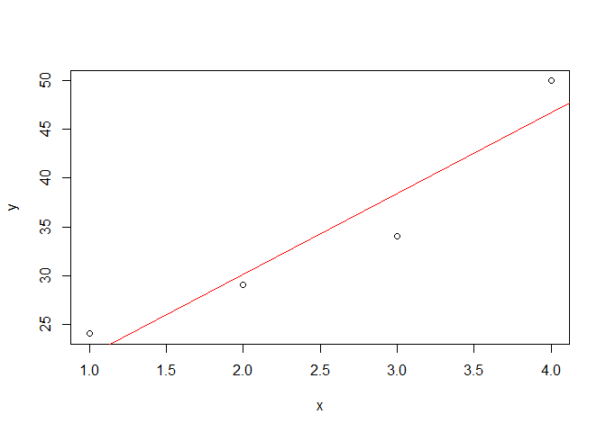
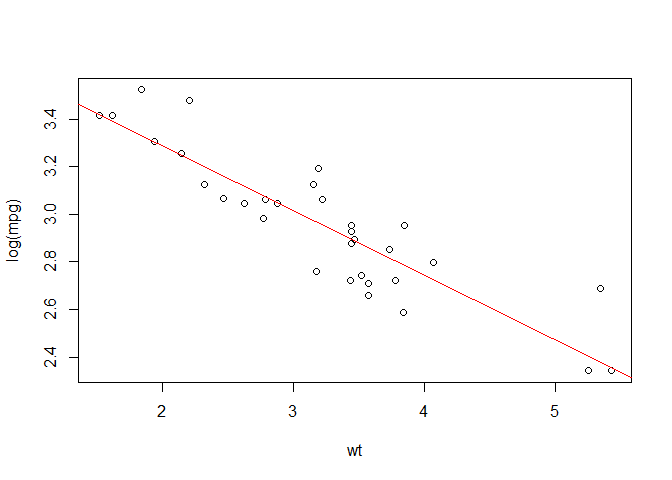

Gradient Descent
================

Take a small dataset

``` r
x <- c(1,2,3,4)
y <- c(24, 29, 34, 50)
plot(x, y)
pars1 <- coefficients(lm(y~x))
abline(pars1, col="red")
```



By linear algebra, the slope of the line is computed to be h(x) = 13.5+8.3x We could try to do this with gradient descent First we need to set up our cost function - mean squared error in this case where MSE = Σ(predicted - y)² / n

``` r
mse <- function(x, y, thetas){
  yhat <- thetas + thetas*x
  mse <- sum((yhat-y)^2)/length(x)
  print(mse)
}
mse(x=x, y=y, thetas=pars1)
```

    ## [1] 124.515

We want to minimise this cost function using gradient descent

``` r
gradDesc <- function(x, y, alpha, max.iter, convthresh){
    # where alpha is the learning rate and we fix the no. of iterations we go through to achieve convergence.
  # In this case we consider convergence as when there ceases to be much improvement in the mean squared error.
  
  n <- length(x)
  # initialise parameters
  intercept <- runif(1,0,1)
  slope <- runif(1,0,1)
  yhat <- intercept + slope*x
  error <- sum((yhat-y)^2)/n
  
  iterations = 0 
  # implement gradient descent (using partial derivatives) and with simultaneous update of the parameters
   while(iterations< max.iter){  
     newintercept <- intercept - alpha * ((1 / n) * (sum(yhat-y)))
     newslope <- slope - alpha * ((1 / n) * (sum((yhat-y) * x)))
     slope <- newslope
     intercept <- newintercept
     yhat <- intercept + slope*x
     new_error <- sum((y-yhat)^2)/n
     delta <- error - new_error
     
     if(delta < convthresh) {
       return(cbind(intercept=intercept, slope=slope))
     }
     iterations=iterations+1
     if(identical(iterations,max.iter)){
        print("Maximum Iterations reached")
        return(cbind(intercept=intercept, slope=slope))
       }
   }
}

gradDesc(x=x, y=y, alpha=0.01, max.iter=50000, convthresh=0.01)
```

    ## [1] "Maximum Iterations reached"

    ##      intercept slope
    ## [1,]      13.5   8.3

And we can see that we get the same outcome as we would have with linear algebra

``` r
coefficients(lm(y~x))
```

    ## (Intercept)           x 
    ##        13.5         8.3

Likewise we can try it on a larger dataset:

``` r
data(mtcars)
str(mtcars)
```

    ## 'data.frame':    32 obs. of  11 variables:
    ##  $ mpg : num  21 21 22.8 21.4 18.7 18.1 14.3 24.4 22.8 19.2 ...
    ##  $ cyl : num  6 6 4 6 8 6 8 4 4 6 ...
    ##  $ disp: num  160 160 108 258 360 ...
    ##  $ hp  : num  110 110 93 110 175 105 245 62 95 123 ...
    ##  $ drat: num  3.9 3.9 3.85 3.08 3.15 2.76 3.21 3.69 3.92 3.92 ...
    ##  $ wt  : num  2.62 2.88 2.32 3.21 3.44 ...
    ##  $ qsec: num  16.5 17 18.6 19.4 17 ...
    ##  $ vs  : num  0 0 1 1 0 1 0 1 1 1 ...
    ##  $ am  : num  1 1 1 0 0 0 0 0 0 0 ...
    ##  $ gear: num  4 4 4 3 3 3 3 4 4 4 ...
    ##  $ carb: num  4 4 1 1 2 1 4 2 2 4 ...

``` r
with(mtcars, plot(wt, log(mpg)))
(pars2 <- coefficients(lm(log(mpg) ~ wt, data=mtcars)))
```

    ## (Intercept)          wt 
    ##   3.8319136  -0.2717847

``` r
abline(pars2, col="red")
```



``` r
with(mtcars, gradDesc(x=wt, y=log(mpg), alpha=0.01, max.iter=50000, convthresh=0.01))
```

    ## [1] "Maximum Iterations reached"

    ##      intercept      slope
    ## [1,]  3.831914 -0.2717847

To expand this further, we could look to use matrix algebra instead to permit multiple predictor variables (or attributes) to be used.
